# Route 53 Clone

A full-stack clone of the **Amazon Route 53 console** for managing hosted zones, DNS records and health checks. The UI is
built with [Cloudscape](https://cloudscape.design/), AWS's own open-source design system and the one the real
console uses, so tables, filters, forms, modals, the split panel and dark mode match the real console. The backend
follows the semantics of the Route 53 API, including atomic `ChangeResourceRecordSets` batches.

Everything runs locally and costs $0: open-source dependencies only, no AWS account, and no paid APIs.

| Light | Dark |
|---|---|
| 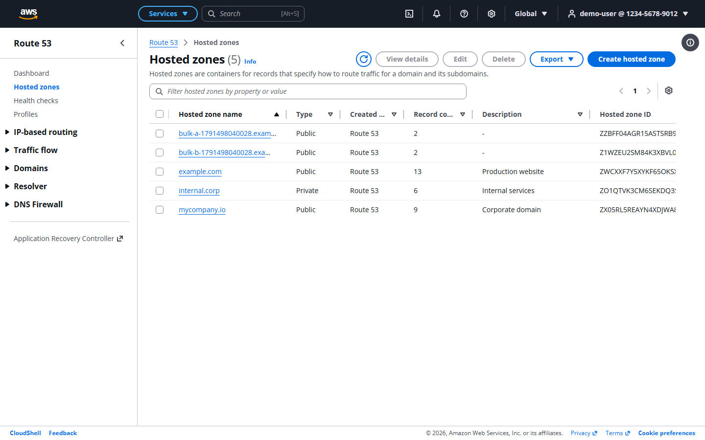 | 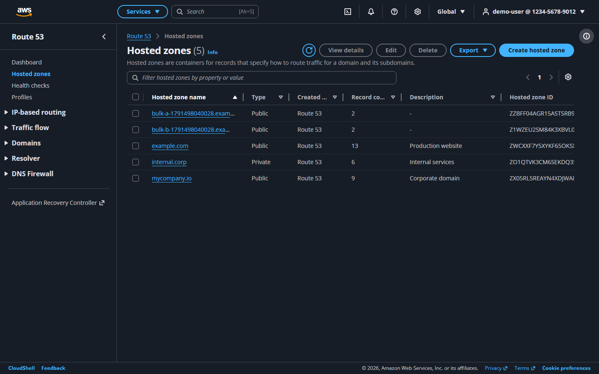 |
| 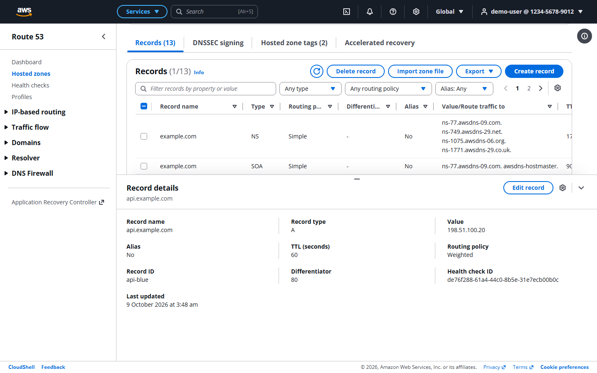 | 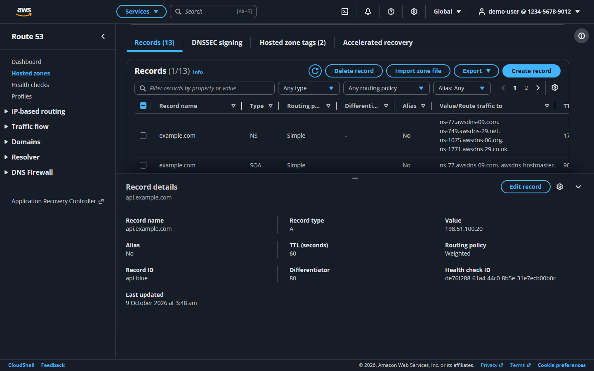 |
| 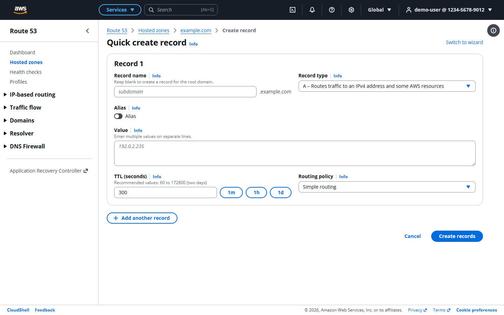 | 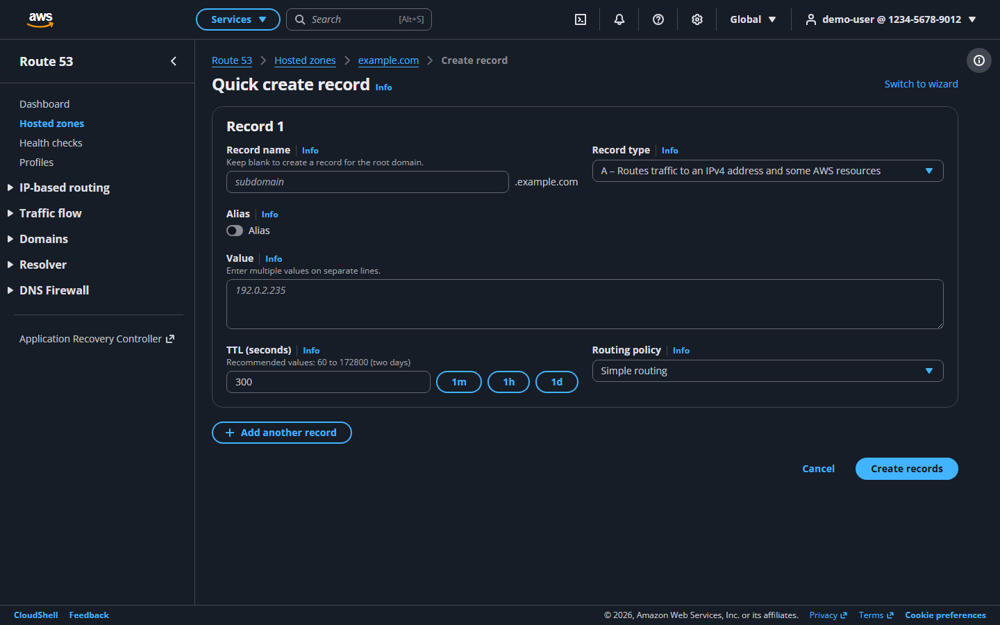 |
| 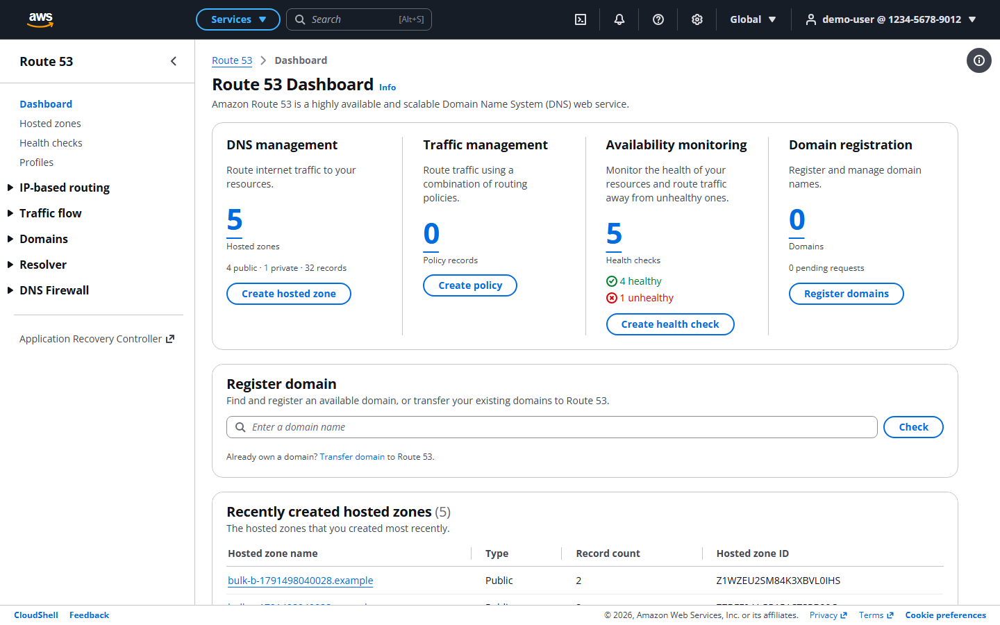 | 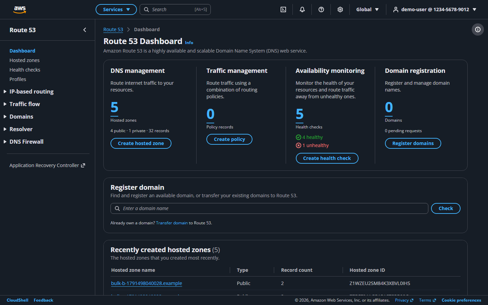 |
| 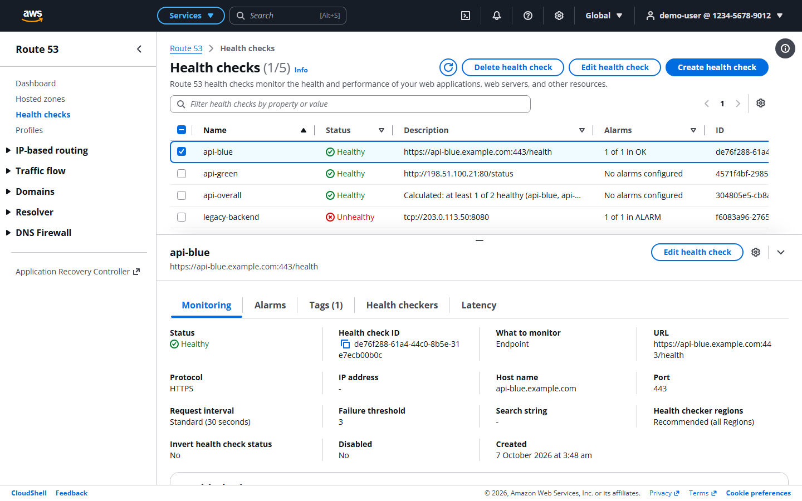 | 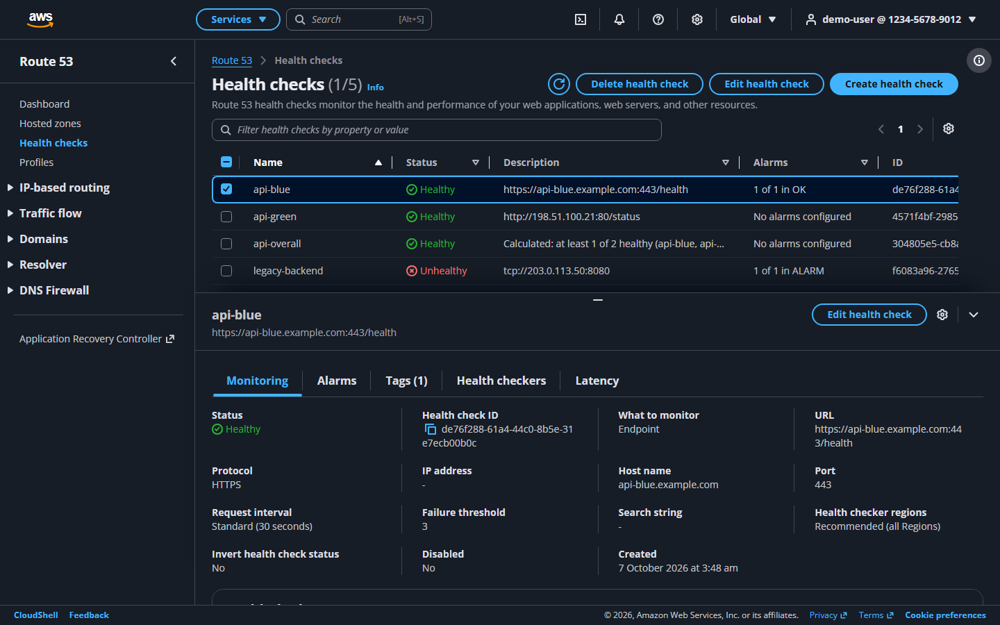 |

## Demo

Hosted link coming soon. Deploy your own copy for free with the Render blueprint; see [Deploy](#deploy).

**Demo credentials:** `demo@example.com` / `demo`. You can also sign in as an IAM user with account `1234-5678-9012`, user name `demo-user` and password `demo`.

---

## Setup

**Prerequisites:** Node.js 20+ and Python 3.11+. If `python` isn't on your PATH, `uv` works:
`uv venv --python 3.12 .venv`.

### Backend (FastAPI, port 8000)

```bash
cd backend
python -m venv .venv
# Windows: .venv\Scripts\activate    macOS/Linux: source .venv/bin/activate
pip install -r requirements.txt
python -m app.seed            # optional: the server also seeds an empty database on startup
uvicorn app.main:app --reload --port 8000
```

- API: <http://localhost:8000/api/v1>. Interactive docs: <http://localhost:8000/docs>.
- `python -m app.seed --reset` wipes all data and reloads the demo data.
- Settings come from environment variables or `backend/.env` (see [`backend/.env.example`](backend/.env.example)).

### Frontend (Next.js, port 3000)

```bash
cd frontend
npm install
cp .env.example .env.local    # BACKEND_URL=http://localhost:8000
npm run dev
```

Open <http://localhost:3000>. On Windows, `./dev.ps1` from the repo root starts both servers together.

### Tests

```bash
cd backend && pytest --cov=app/services        # 103 tests, ~93% coverage of services; uses a temp SQLite DB
cd e2e && npm install && npx playwright install chromium && npx playwright test   # needs both servers running
```

The Playwright suite (7 tests) runs the whole walkthrough: sign in → create a zone → create one record of each of
the 9 required types in one batch → edit one → bulk-delete them → delete the zone → sign out → sign in. It also covers
the dashboard, the health check lifecycle (create → Unknown → Healthy → edit → delete), bulk zone delete and export,
navigation, filters and keyboard shortcuts.
`npm run screenshots` in `e2e/` regenerates the README images.

---

## Architecture

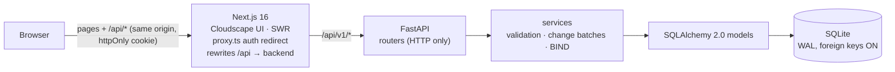

- **Single origin.** Next.js rewrites `/api/*` to FastAPI, so the browser only talks to `localhost:3000`. The
  session cookie works without any CORS setup.
- **Layering.** Routers only do HTTP work. `services/` holds the business rules: per-type validation, the atomic
  change-batch engine, record counts, NS/SOA protection and BIND import/export. `models.py` holds persistence.
- **Atomic change batches.** `POST /hostedzones/{id}/rrset` replays every change against an in-memory copy of the
  zone. It then checks the zone-wide rules (CNAME conflicts, mixed routing policies), and writes either everything
  or nothing in one transaction. Quick create, edit and bulk delete in the UI all use this endpoint.
- **Shared validation.** [`frontend/src/lib/validators.ts`](frontend/src/lib/validators.ts) mirrors
  [`backend/app/services/validation.py`](backend/app/services/validation.py) rule for rule and message for
  message, so inline errors match what the API would return. Server errors carry a `field` such as
  `changes[2].values[0]`, which the form maps back onto the exact row and field.

**Why Cloudscape?** It is the design system the real AWS console is built on. Using it gives the console's tables,
property filter, pagination, preferences, split panel, flashbar, help panel, modals and visual modes as they really
look, instead of hand-made look-alike CSS.

---

## Database schema

SQLite (`backend/route53.db`), created on startup. All writes for a request happen in one transaction.

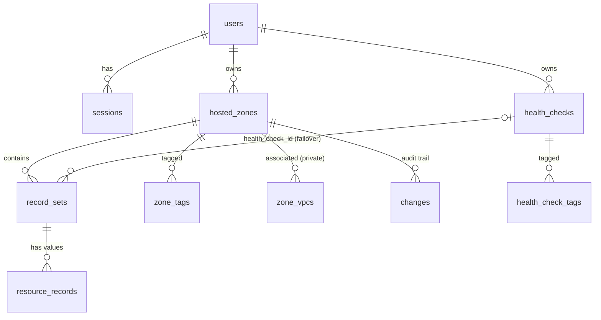

| Table | Purpose / key columns |
|---|---|
| `users` | `email` (unique), `display_name`, `account_id` (mock 12-digit), `password_hash` (bcrypt) |
| `sessions` | `token` = SHA-256 of the cookie value, `user_id`, `expires_at` |
| `hosted_zones` | `id` (`Z` + 20 chars), `owner_id`, `name` (lower-case, trailing dot), `comment`, `is_private`, `caller_reference` (unique per owner), `record_count` (denormalised, includes NS/SOA), `name_servers` (JSON) |
| `zone_vpcs` | `zone_id`, `vpc_id`, `vpc_region` (unique together) |
| `zone_tags` | PK (`zone_id`, `key`), `value` |
| `record_sets` | `zone_id`, `name`, `type` (CHECK over the 13 types), `ttl` (NULL for alias), `set_identifier`, `routing_policy`, `weight`, `region`, `failover`, `geo_location`, `multivalue`, `cidr_routing`, `geoproximity`, `health_check_id`, `alias_target` (JSON), `is_default` |
| `resource_records` | `record_set_id`, `value`, `position` (one row per value line, keeps the user's order) |
| `changes` | `id` (`C` + 20 chars), `zone_id`, `comment`, `submitted_at`, `payload` (JSON of the batch) |
| `health_checks` | `id` (UUID), `owner_id`, `caller_reference` (unique per owner), `name`, `type` (CHECK: HTTP, HTTPS, HTTP_STR_MATCH, HTTPS_STR_MATCH, TCP, CALCULATED, CLOUDWATCH_METRIC), `ip_address`, `fqdn`, `port`, `resource_path`, `search_string`, `request_interval`, `failure_threshold`, `measure_latency`, `enable_sni`, `regions` (JSON), `child_health_checks` (JSON), `health_threshold`, `cloudwatch_alarm` (JSON), `inverted`, `disabled`, `notification` (JSON: SNS topic + emails), `version` |
| `health_check_tags` | PK (`health_check_id`, `key`), `value` |

Record identity is enforced by a unique expression index on
`(zone_id, name, type, COALESCE(set_identifier, ''))`, because SQLite treats NULLs as distinct in plain
UNIQUE constraints. `cidr_routing` and `geoproximity` extend the planned schema so that IP-based and
geoproximity settings are stored too.

---

## API overview

All endpoints are under `/api/v1` and require the `r53_session` cookie except login. Errors look like
Route 53 errors:

```json
{ "error": { "code": "InvalidChangeBatch", "message": "Tried to create resource record set [name='www.example.com.', type='A'] but it already exists", "field": "changes[0].name", "errors": [ ... ] } }
```

| Method | Path | Notes |
|---|---|---|
| POST | `/auth/login` | `{email, password}` or `{account_id, username, password}`; sets the httpOnly `r53_session` cookie (SameSite=Lax) |
| POST | `/auth/logout` | Deletes the session row and clears the cookie |
| GET | `/auth/me` | Current user, or 401 |
| GET | `/hostedzones?search=&type=&sort=&order=&page=&page_size=` | `{items, total, page, page_size}` |
| POST | `/hostedzones` | `{name, comment?, private_zone, vpcs?, tags?}` → 201 with `hosted_zone`, `change_info` and `delegation_set`; creates NS and SOA |
| POST | `/hostedzones/batch-delete` | `{ids}`: bulk delete, atomic. Fails with `HostedZoneNotEmpty` (and deletes nothing) if any zone has records |
| GET | `/hostedzones/export?format=json\|bind&ids=` | Export all hosted zones, or only the given `ids`, with their record sets |
| GET | `/hostedzones/{id}` | Zone, name servers, VPCs and tags |
| PATCH | `/hostedzones/{id}` | `{comment}` (UpdateHostedZoneComment) |
| PUT | `/hostedzones/{id}/tags` | Replaces all tags |
| DELETE | `/hostedzones/{id}` | 400 `HostedZoneNotEmpty` unless only NS/SOA remain |
| GET | `/hostedzones/{id}/recordsets?search=&type=&routing_policy=&alias=` | List record sets |
| GET | `/hostedzones/{id}/recordsets/{rid}` | One record set |
| POST | `/hostedzones/{id}/rrset` | **ChangeResourceRecordSets**: `{comment?, changes: [{action: CREATE\|UPSERT\|DELETE, record_set}]}`; atomic |
| DELETE | `/hostedzones/{id}/recordsets/{rid}` | Convenience single delete |
| GET | `/changes/{id}` | `{id, status: PENDING\|INSYNC, submitted_at}`; INSYNC about 2 s after submission |
| POST | `/hostedzones/{id}/import?dry_run=` | `{zone_file}`: BIND import (preview with `dry_run=true`); skips SOA and apex NS |
| GET | `/hostedzones/{id}/export?format=json\|bind` | ListResourceRecordSets-shaped JSON, or a BIND zone file |
| GET | `/dashboard` | Counts for the dashboard: hosted zones (public/private), record sets, health checks by status |
| GET | `/healthchecks` | List health checks with simulated `status`, `description` (URL) and `alarms` |
| POST | `/healthchecks` | CreateHealthCheck: endpoint (HTTP/HTTPS/TCP, optional string matching), calculated, or CloudWatch alarm; optional SNS notification and tags |
| GET / PUT / DELETE | `/healthchecks/{id}` | Get; update (type, protocol, request interval and latency graphs are immutable); delete (400 `HealthCheckInUse` if a record or calculated check uses it) |
| POST | `/healthchecks/batch-delete` | `{ids}`: bulk delete, atomic |
| PUT | `/healthchecks/{id}/tags` | Replace tags |
| GET | `/healthchecks/{id}/status` | GetHealthCheckStatus: per-Region health checker observations |
| GET | `/healthchecks/{id}/metrics` | Last hour of percentage-healthy and latency data for the Monitoring and Latency charts |
| GET | `/api/health` | Liveness |

Full schema: <http://localhost:8000/docs>.

---

## Features

### Required

- [x] Mock sign-in (root user / IAM user), sign-out, and a session that survives reloads and backend restarts
- [x] Console shell: top navigation (Services, Alt+S search, CloudShell, notifications, help, settings, Global region, account menu), full Route 53 side navigation, breadcrumbs, help drawer with Info links, flashbar, footer
- [x] Hosted zones: list, property filter (`=`, `!=`, contains, does not contain), sort, paginate, column and density preferences (saved in localStorage), filters kept in the URL
- [x] Create zones (public, or private with VPC associations and tags), with a warning for duplicate names; edit the description and tags; delete with a typed "delete" confirmation and the non-empty guard
- [x] Zone detail page: details section with copyable name servers, plus Records / DNSSEC / Tags / Accelerated recovery tabs
- [x] Records: A, AAAA, CAA, CNAME, MX, NS, PTR, SRV and TXT (plus DS, NAPTR, SPF, and editing the SOA), with the same validation on client and server
- [x] Records table with property filter plus Type / Routing policy / Alias dropdowns, multi-select, and a split panel with record details
- [x] Multi-row Quick create (one atomic batch, errors mapped back to the row and field), alias targets, TTL presets, all 8 routing policies (stored, not evaluated)
- [x] Edit record (UPSERT; changing the Record ID becomes DELETE + CREATE in one batch), bulk delete, NS/SOA protection, record count kept in sync
- [x] **Dashboard** modelled on the console's: DNS management, Traffic management, Availability monitoring and Domain registration summaries, Register domain search (mocked), recently created hosted zones, notifications
- [x] **Health checks** (persisted in SQLite): list with status, description, alarms and ID; property filter; split panel with Monitoring (status chart), Alarms, Tags, Health checkers and Latency (chart) tabs; 2-step create wizard (Configure health check → Get notified when health check fails) for endpoint, calculated and CloudWatch alarm checks; edit; delete with typed confirmation and in-use protection. Records can reference a health check for failover routing
- [x] "Coming soon" pages for every other section (Profiles, Traffic flow, Domains, Resolver, DNS Firewall, CIDR collections)

### Bonus

- [x] BIND zone file import (paste or upload, preview, then import atomically)
- [x] Export as JSON or BIND: one zone (Records tab), or all/selected hosted zones (Hosted zones page)
- [x] Bulk operations: multi-select bulk delete for hosted zones, records and health checks (each one atomic), multi-row record creation
- [x] Dark mode (account menu or gear icon → Visual mode: Light / Dark / Browser default), applied before first paint
- [x] Keyboard shortcuts
- [x] Record creation wizard (Choose routing policy → Configure records → Review and create)
- [x] "Test record" modal that answers from the zone's records, wildcards included
- [x] Mocked change propagation: a PENDING flash that turns into INSYNC
- [x] pytest suite (103 tests) and a Playwright end-to-end suite (7 tests)

### Keyboard shortcuts

| Keys | Action |
|---|---|
| `?` | Show keyboard shortcuts |
| `Alt+S` | Focus the top search bar |
| `/` | Focus the table filter |
| `c` | Create a hosted zone or record (depends on the page) |
| `r` | Refresh the table |
| `Delete` | Delete the selected items |
| `Esc` | Close the open modal or clear the selection / split panel |
| `g` then `z` / `g` then `d` | Go to Hosted zones / Dashboard |

Shortcuts are ignored while you're typing in a field.

### Known limitations

- No real DNS: nothing is served or resolved, and "Test record" answers from the database.
- Routing policies and alias targets are stored and validated but not evaluated.
- Health checks don't probe anything. Status is simulated: a new check is Unknown for a few seconds, then Healthy;
  endpoints in 203.0.113.0/24 or with a host name that starts with `down.` or contains `unhealthy` are Unhealthy;
  calculated checks follow their children; disabled checks are Healthy; "invert" flips the result.
- VPCs, health checks, CIDR collections and AWS accounts are mocked; there is one demo user.
- Change status is simulated: PENDING becomes INSYNC about 2 seconds after submission.
- Hosted zone and record listing is filtered client-side, which suits up to a few thousand records. The API also supports server-side paging.
- Hosted zones, records, health checks and the dashboard are implemented; other sections show "Coming soon".

## Deploy

Free hosting with [Render](https://render.com), using the blueprint in [`render.yaml`](render.yaml):

1. Push this repository to GitHub.
2. In Render, choose **New → Blueprint**, connect the repository, and apply it. This creates
   `route53-clone-api` (FastAPI) and `route53-clone-web` (Next.js).
3. When asked for `BACKEND_URL`, enter the API's URL, for example `https://route53-clone-api.onrender.com`.
4. Open the web service's URL and sign in with the demo credentials.

The browser only talks to the Next.js service, which proxies `/api/*` to FastAPI, so the session cookie stays
first-party and no CORS setup is needed. On the free plan the disk is ephemeral, so SQLite is recreated and re-seeded
with the demo data on each restart or redeploy, and services sleep when idle (the first request takes about a minute).

## Repository layout

```
backend/   FastAPI app (app/routers, app/services, app/models.py, app/seed.py) and pytest suite
frontend/  Next.js App Router + Cloudscape (src/app/route53/v2/... mirrors real console URLs)
e2e/       Playwright smoke test and screenshot script
docs/      README screenshots
PLAN.md    Implementation plan
```
